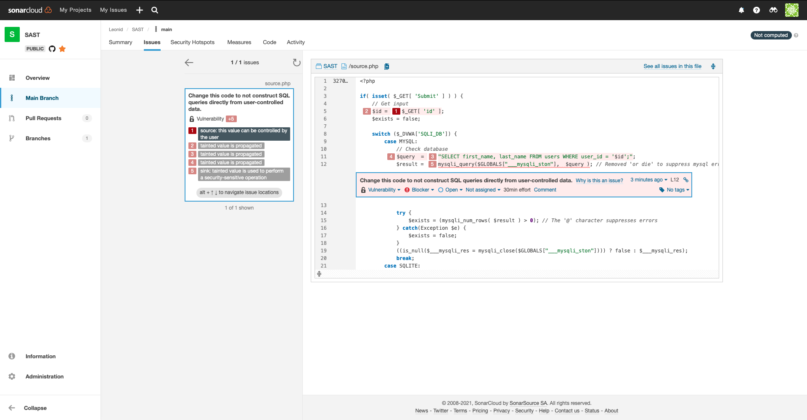

# SAST

## 1 Пункт

Необходимо найти участок кода, содержащий инъекцию SQL кода в задании Blind Sql Injection на сайте dvwa.local с использованием статического анализатора кода. 
Проанализировать код и сделать кодревью, указав слабые места.

Использовался статический анализатор https://sonarcloud.io/

Статический анализатор нашёл 5 проблем.

1. > $_GET[ 'id' ];

    Использование GET запроса, а значит возможность атаки MITM(Man in the middle). Рекомендация: Использовать POST запрос.

2. > $id = 
3. > "SELECT first_name, last_name FROM users WHERE user_id = '$id';";

    Так как переменная '$id' никак не обрабатывается и просто передаётся в SQL запрос, то здесь налицо возможность использования SQL инъекции. Рекомендация: Обработать переменную '$id'.

4. > $query  = 
5. > mysqli_query($GLOBALS["___mysqli_ston"],  $query );

## 2 Пункт

Разработать свою систему вывода информации об объекте на любом языке, исключающий возможность инъекции SQL кода. Возможно исправление участка кода из dvwa.local

Я, как и в прошлой работе с Brute Force, исправлю участок кода из dvwa.local.
Так как нет обработки id и нежелательный метод передачи данных, то это и буду исправлять. 
Самый простой вариант для обработки - убрать из строки специальные символы. В php присутствует необходимая функция:

> $id = real_escape_string($_POST[ 'id' ]) 

Здесь мы таже заменили GET на POST, чем закрыли обнаруженные уязвимости.

Статический анализатор не выявил ранее найденных уязвимостей после исправления.

